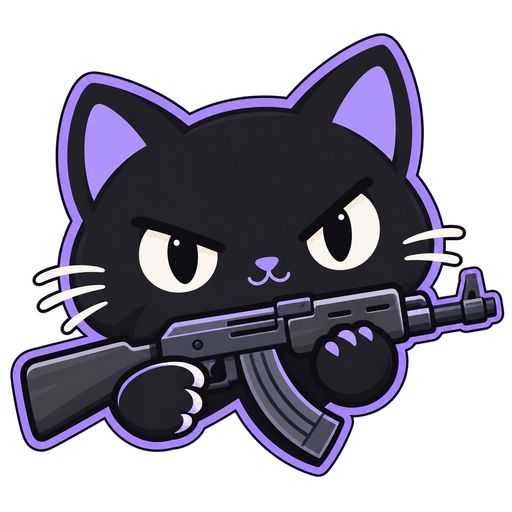

# 瞄瞄 · AimMeow

喵，我是瞄瞄，你的 KovaaK's 瞄准训练搭子。告诉我这次能练多久，我会结合已有成绩和最近的练习，帮你安排热身、专项练习与少量探索，也会记下每张图的进步。

## 我能帮你做什么

- 按时间、近期训练和已有 Benchmark 成绩安排 VDIM 训练列表。
- 自动记录完整对局，查看成绩趋势、个人锚点、鼠标轨迹和可用的视频回放。
- 读取本地 SCE 场景文件，为相似练习提供机制和精度对照；统一难度模型仍未完成。
- 发现社区练习，为下一次训练加入变化，已经开始的列表保持固定。

## 开始练习

Windows 构建与正式版本见本仓库的 [Actions](https://github.com/Senkoi/refleks/actions) 和 [Releases](https://github.com/Senkoi/refleks/releases)。首个瞄瞄正式版本发布前，请使用品牌分支的构建。

1. 解压构建并启动 `aimmeow.exe`。界面需要 Microsoft WebView2；录像回放另需 FFmpeg。
2. 在设置中确认 KovaaK's 安装目录、Steam 账号和用户名。
3. 到训练工作台选择时间，生成并安装列表。
4. 重启 KovaaK's，在 Local Playlists 打开 `AimMeow Current`，然后回工作台开始计时。

列表开始后会保持固定；新成绩用于下一次安排。旧版已经开始的列表仍可继续，直到本次训练结束。每次自动安装复用一个槽位，不会不断堆积新列表。

## 升级与本地数据

瞄瞄继续读取原来的 `~/.refleks` 设置、成绩、回放和训练状态，不需要你搬家喵。旧记录的 `.refleks` 扩展名与界面设置键保持兼容。两款程序使用相同的数据目录和单实例保护，使用瞄瞄前请退出原版。

训练上传默认关闭，也没有默认上传地址。未明确配置同步服务时，旧版启用上传的设置不会让瞄瞄继续发送记录。Benchmark 目录仍读取 Refleks 的公开目录，成绩查询使用 KovaaK's 服务；来源见 [致谢与声明](THIRD_PARTY_NOTICES.md)。

高级环境变量使用 `AIMMEOW_` 前缀，也兼容旧 `REFLEKS_` 前缀，新前缀优先。可选的 `AIMMEOW_BRAVE_API_KEY` 扩展资源搜索；不配置也能扫描公开训练资源。

## 参与和支持

试用、反馈问题和贡献代码，都能帮瞄瞄成长喵。[贡献指南](CONTRIBUTING.md)介绍了构建和检查方式。瞄瞄暂未设置收款入口。

## 来源与许可证

瞄瞄基于 [ARm8-2/refleks](https://github.com/ARm8-2/refleks) 独立开发。感谢原作者和社区提供基础功能，以及 VDIM、Voltaic、4BK、MattyOW 的训练资料。

Copyright (c) RefleK's Contributors and AimMeow Contributors.

沿用 [GNU GPL v3.0](LICENSE)，保留原作者版权与提交历史。详见 [来源与致谢](THIRD_PARTY_NOTICES.md)。
